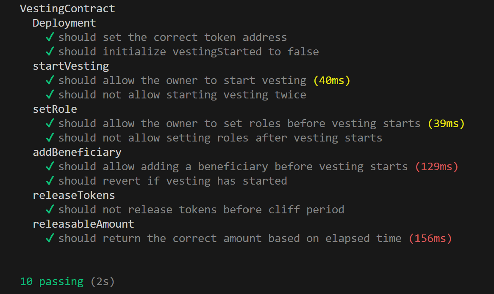

# vesting Token
steps to setup the code:

# step1:
-Clone or Copy the Github Repository.</br>
-open it in any IDE(like VScode).</br>


# step2:
Run the followind command in backend to install the node module of the project:
```bash  
  npm i
```
# step3:
Change the wallet address in the `hardhat.config.js` file</br>
Run the following command in terminal</br>
To complie the contract: 
```bash 
    npx hardhat compile"
```    
To deploy the contract: 
```bash 
    npx hardhat ignition deploy ./ignition/modules/Lock.js
```    

# step5:
To run the test cases:</br>
```bash
    npx hardhat test
```    

`test results`:



